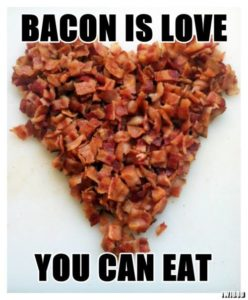
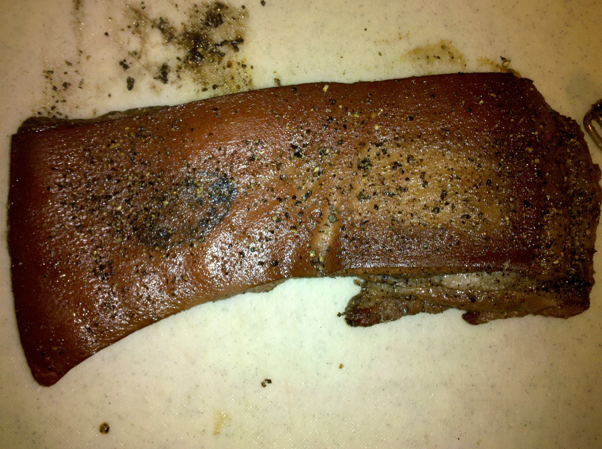
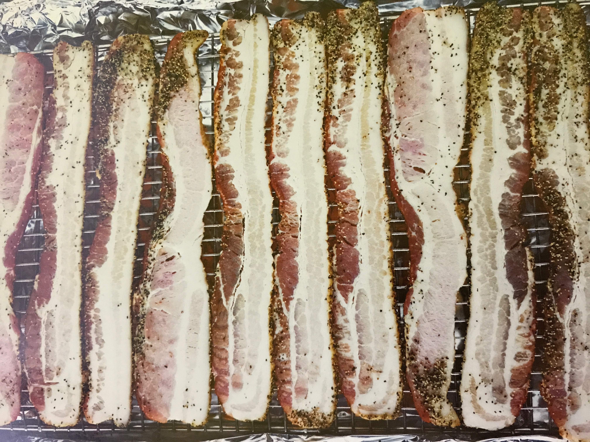
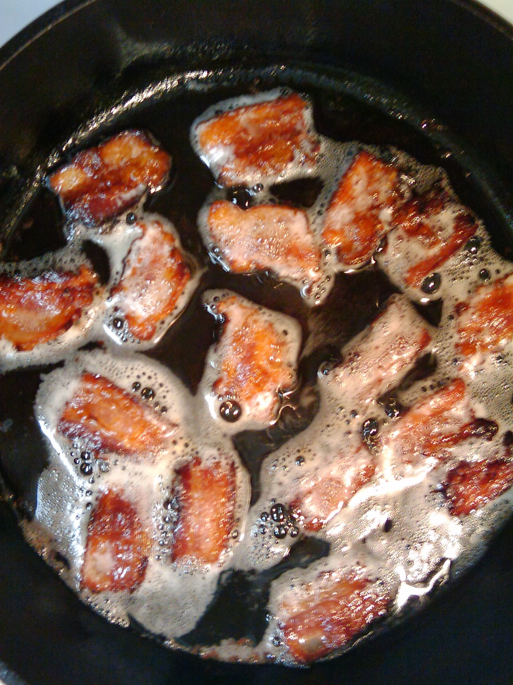
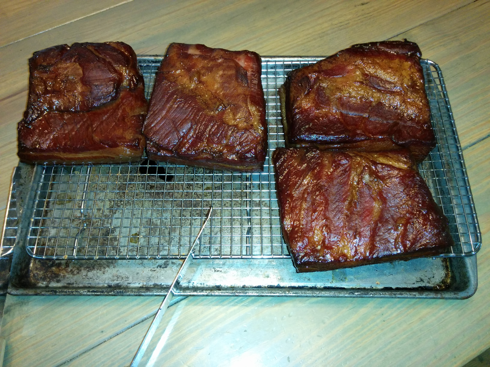

---?image=assets/belly.jpg
# Makin' Bacon

---

> “Is it Bacon Day?”

---

# That's *NOT* Crazy Talk

---

# Types of Bacon

- Green
- Uncured
- Nitrate-Free
- Wet-Cured
- Dry-Cured

---?image=assets/bacontree.png
# Green Bacon

- Vegetarian Bacon
- Not really            |
- Cured, but not smoked |

---

# Uncured Bacon

Smoked but not cured

---

# Nitrate-Free Bacon

- Cured without using sodium nitrate
- Uses nitrates found in cabbage and celery

---

# Wet-Cured Bacon

- Soaked in a brine before smoking
- What you buy commercially

---

# Dry-Cured Bacon

- Rubbed with dry salt mix before smoking
- What you'll be making today

---

# Cooking Bacon

---

# Oven Method

---

- Lay slices of bacon on rack under foil lined baking sheet
- Place in *cold* oven
- Bake at 400 degrees for 20-25 minutes
- Transfer cooked bacon to paper towels

---

# Stovetop Method

---

- Place bacon in frying pan or cast iron skillet
- Cook over medium heat, 4-5 minutes per side
- Turn often with tongs
- Transfer cooked bacon to paper towels

---

# Basic Dry Cure

- 3 pounds / 1.36 Kg kosher salt (1 box of Morton Kosher Salt)
- 1.5 pounds / 675 grams sugar
- 6 ounces / 150 grams pink salt (10 tablepoons)[1](#footnote1)

<a name="footnote1">1</a>: You can get pink salt and other butcher supplies at [Allied Kenco](http://www.alliedkenco.com)

---

# Bacon

### Ingredients

- 1 3-5 pound pork belly slab with the skin still on
- 1/4 cup (50 grams) [basic dry cure](basic_dry_cure.md)
- 1/2 cup (125 grams) brown sugar

---

### Preperation

- Place pork belly, cure, sugar and any additional seasonings in a Ziploc bag. Seal and shake to distribute ingredients.
- Refrigerate the belly for 7 days. Flip the bag every other day to redistribute the cure.
- Once firm, remove belly from cure, rinse thoroughly, and pat dry with paper towels. Refrigerate on a rack over a baking sheet for 12-36 hours or until a nice pellicle forms.

---

- Hot smoke to a temperature of 150 degrees F./65 degrees C.
- When cool enough to handle but still warm, cut skin off leaving as much fat on the bacon as possible. (Or leave the skin on for "rind on bacon"). Skin can be cut up and used in soups or stews or can be used to make pork rinds.

Yield: 2-4 pounds of smoked slab bacon

---

# Let's make some bacon!

---

# Thank You

* Slides: https://gitpitch.com/cmason/makinbacon
* Recipes: https://github.com/cmason/recipes
